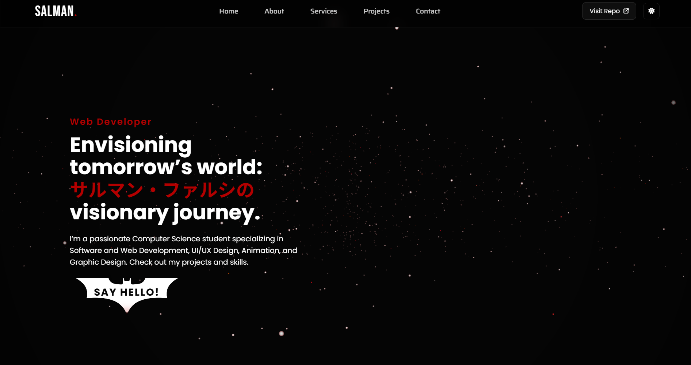

# 🚀 Salman Farsi - Interactive Portfolio


A highly interactive, responsive, and visually engaging personal portfolio website built with **HTML, CSS, JavaScript, and Three.js**. 

This project showcases advanced front-end techniques including 3D backgrounds, complex CSS animations, glassmorphism, and dynamic theme switching.

## 🔗 Live Demo
### [👉 Click here to view the Live Site](https://salmansync.github.io/Protfolio-Complete/)

---

## ✨ Key Features

### 1. 🎨 Dynamic Theme Switcher (Dark/Light Mode)
* **Implementation:** CSS Variables (`:root` vs `body.light-mode`) and LocalStorage persistence.
* **Details:** * **Dark Mode:** Features a deep space galaxy aesthetic with glowing accents.
    * **Light Mode:** Switches to a premium, clean "paper" look with inverted textures and soft shadows.
    * **Persistence:** Remembers the user's preference even after refreshing the page.

### 2. 🐱 Custom CSS Animated Loader
* **The "Typing Cat":** A fully custom, **pure CSS** animation (no images!) of a cat typing on a keyboard.
* **Details:** Includes animated paws pressing physical keys, blinking eyes, blushing cheeks, and a wagging tail. The loader fades out smoothly once the window loads.

### 3. 🌌 3D Interactive Background
* **Library:** [Three.js](https://threejs.org/)
* **Effect:** A particle-based starfield (Galaxy) that rotates and responds to scroll speed.
* **Adaptive:** The star colors and blending modes invert automatically when switching between Light and Dark modes.

### 4. ⌨️ Matrix & Glitch Typing Effects
* **Name Cycle:** Cycles between English and Japanese (Katakana) characters.
* **Bio Glitch:** A "Matrix-style" decoding effect where text rapidly cycles through random symbols before settling on the correct character.
* **Optimization:** Logic refined to ensure perfect readability while maintaining a high-tech feel.

### 5. 📱 Fully Responsive Design
* **Glassmorphism Navbar:** A sticky, blurry navigation bar that adapts to mobile screens with a custom hamburger menu.
* **Mobile Optimizations:** Touch-supported hover effects (e.g., the "Batman" button squashes when touched on mobile).

### 6. 📨 Contact Form Integration
* **Backend:** Connected to **Google Sheets** via Google Apps Script to collect messages without a server.

---

## 🛠️ Tech Stack

* **Frontend:** HTML5, CSS3, JavaScript (ES6+)
* **Libraries:** [Three.js](https://threejs.org/) (3D Background), [FontAwesome](https://fontawesome.com/) (Icons)
* **Fonts:** Google Fonts (Poppins, Fira Code, Noto Sans JP, Bungee)
* **Design Style:** Glassmorphism, Neumorphism (Light Mode), Cyberpunk (Dark Mode)

---

## 📂 Project Structure

```text
├── index.html       # Main HTML structure
├── style.css        # All styling, animations, and responsive rules
├── script.js        # Logic for Three.js, Typing, Theme Toggle, and Loader
└── images/          # Project screenshots and assets
